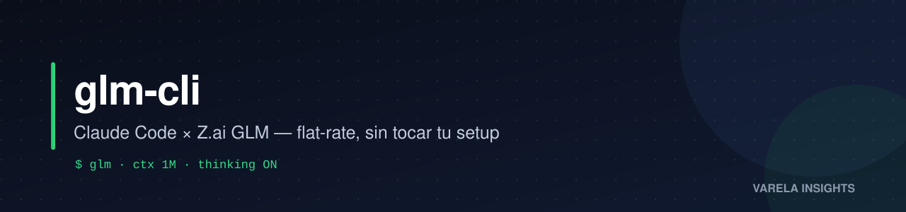

<p align="center"></p>
<p align="center">
  
  
  
  <a href="https://www.varelainsights.com/"></a>
</p>

# glm-cli

> Ejecuta **Claude Code** sobre **Z.ai GLM-4.7** — un modelo de código fuerte en uso de herramientas — sin tocar tu `claude` por defecto.

`glm` y `glmf` son dos *wrappers* livianos que lanzan el binario real de Claude Code con variables de entorno acotadas a esa única invocación, apuntándolo al endpoint *Anthropic-compatible* de Z.ai. Tu comando `claude` (API Anthropic / plan Max) **nunca se modifica**: no se toca el `settings.json` global, así que ambos mundos coexisten en la misma shell.

| Comando | Modelo | Cuándo |
|---------|-------|--------|
| `glm`   | `glm-4.7` (ctx 200K, *thinking* ON) | Trabajo duro — debug, multi-paso, uso de herramientas |
| `glmf`  | `glm-5-turbo` (*thinking* OFF) | Tareas rápidas — edits, *lookups*, un solo prompt |
| `claude`| *(sin cambios)* | Tu *default* — Anthropic / Max |

## TL;DR (English)

**glm-cli** runs **Claude Code on Z.ai's GLM models** (flat-rate, 1M-token context) as an alternate backend **without touching your default `claude` setup**: the `glm` and `glmf` shell wrappers point one single invocation at Z.ai's Anthropic-compatible endpoint — your global `settings.json` is never modified, so the Anthropic/Max plan and GLM coexist in the same shell. Install: `curl -fsSL https://kessel.varelainsights.com/glm | bash`. MIT license, maintained by [Varela Insights](https://www.varelainsights.com/) (Monterrey, Mexico).

## 💡 El diferenciador: API key + tarifa plana

Z.ai te da una **API key** (estándar *Anthropic-compatible*) con **tarifa plana mensual** (Lite $18 / Pro $72 / Max $160) — portable a *cualquier* cliente, incluido este Claude Code.

**Claude y Codex no ofrecen eso.** Ambos tienen planes de tarifa plana (Claude Max, ChatGPT/Codex), pero **atados a su propio CLI o web**. Si quieres su modelo vía **API key** en otro cliente, es estrictamente **pago por token**: la API de Anthropic y de OpenAI no tienen plan *flat-rate*.

| Proveedor | Tarifa plana en su propio CLI | **API key** + tarifa plana |
|---|:---:|:---:|
| **Z.ai (GLM)** | ✓ | ✓ — portátil a cualquier cliente |
| **Claude (Anthropic)** | ✓ (Pro / Max) | ✗ — la API es solo pago por token |
| **Codex (OpenAI)** | ✓ (ChatGPT) | ✗ — la API es solo pago por token |

→ Por eso existe `glm-cli`: correr **Claude Code** (skills, agentes, MCP — todo el UX) sobre **GLM a tarifa plana**, usando una API key de Z.ai.

> *Nota honesta: el plan tiene límites por ventana de **5 h** y **semanales** ([devpack/overview](https://docs.z.ai/devpack/overview)) — Lite 80/5h · 400/sem, Pro 400/5h · 2,000/sem, Max 1,600/5h · 8,000/sem. Cada prompt invoca el modelo ~15-20×, y la cuota mensual equivale a ~15-30× la tarifa. Tarifa plana, **no** uso ilimitado.*
>
> *Bonus del plan: incluye **Web Search MCP, Web Reader MCP y Zread MCP** (cuota mensual: Lite 100 / Pro 1,000 / Max 4,000) y **Vision MCP** (comparte el pool de 5 h) — todo utilizable desde Claude Code.*

## ✅ Plataformas soportadas

**No funciona en todos los sistemas.** Depende de dos cosas: que tu SO corra `bash` + `curl`, y que el **instalador nativo de Claude** (que este script invoca) lo soporte. Matriz real, verificada contra el código de ambos instaladores:

| Sistema | ¿Funciona? | Notas |
|---------|:----------:|-------|
| **Linux** (cualquier distro con bash) | ✅ | Nativo |
| **macOS** | ✅ | bash 3.2 y zsh soportados; detecta tu *shell* y escribe el `rc` correcto |
| **Windows vía WSL** (Ubuntu, etc.) | ✅ | Dentro de WSL es Linux → funciona igual |
| **Windows nativo** (PowerShell / cmd) | ❌ | Este script es bash. Necesitas WSL, o un port a `.ps1`/`.cmd` (no incluido) |
| **Git Bash / MSYS2 / Cygwin** (en Windows) | ❌ | El instalador nativo de Claude **los rechaza**: `Windows is not supported by this script` |

> **¿Usas Windows nativo?** La forma soportada de usar glm-cli es **WSL**. Si lo necesitas en PowerShell nativo (*wrappers* `.cmd`/`.ps1`), abre un issue — es un port separado que no está incluido aquí.

## Requisitos

- **bash** + **curl** (vienen en toda distro Linux y en macOS).
- Una **API key de Z.ai** (ver más abajo).
- Conexión a internet (la 1ª vez se descargan Claude Code y los *wrappers*).

## ⚡ Instalación rápida

**Linux / macOS / WSL** — un solo comando:

```bash
curl -fsSL https://kessel.varelainsights.com/glm | bash
```

> `kessel.varelainsights.com/glm` es un *redirect* 302 al `install.sh` de **este repo** (rama `main`) — nos permite contar instalaciones, que GitHub no expone para archivos raw. El script que ejecutas es exactamente el del repo; si prefieres saltarte el redirect: `curl -fsSL https://raw.githubusercontent.com/varelaia/glm-cli/main/install.sh | bash`.

> **Ojo — `curl | bash` ejecuta un script remoto que no leíste** (el mismo *trade-off* que asume el instalador de Antigravity). Si prefieres auditarlo primero, clona, lee `install.sh` y córrelo:
>
> ```bash
> git clone https://github.com/varelaia/glm-cli
> cd glm-cli && bash install.sh
> ```

El instalador es **idempotente** y hace 5 cosas:

1. Instala Claude Code vía el instalador nativo oficial (lo saltea si ya está).
2. Asegura que `~/.local/bin` esté en tu `PATH` — escribe tu `.bashrc` / `.zshrc` / `.profile` según tu *shell*, **sin duplicar** líneas (detecta las que ya existen en forma `$HOME` o expandida).
3. Instala `glm` y `glmf` en `~/.local/bin` (ejecutables) — los lee de `./bin` si clonaste, o los descarga del repo si usaste `curl|bash`.
4. Pide tu API key de Z.ai y la guarda en `~/.zai_api_key` (`chmod 600`). Acepta la key de un *prompt* interactivo, o no interactivamente desde la variable `ZAI_API_KEY`.
5. Verifica *end-to-end* contra `https://api.z.ai/api/anthropic` (una llamada real a `glm-4.7` esperando HTTP 200).

Después, abre una *shell* nueva y corre `glm`. En el primer arranque Claude Code pregunta *"Use this API key?"* → **Yes** (una vez). Confirma el modelo con `/model`.

### Obtener una API key de Z.ai

1. Crea cuenta en **https://z.ai**.
2. Ve a **https://z.ai/manage-apikey** → *API Keys* → *Create*.
3. Suscríbete a un plan de *coding* (p. ej. **GLM Coding Pro**, mensual) en **https://z.ai/payment**.
4. Copia la key completa. Tiene la forma `<32 chars hex>.<sufijo>` — si no, se truncó y la autenticación fallará.

## Cómo se preserva tu `claude` por defecto

Cada *wrapper* es un script plano:

```bash
ANTHROPIC_BASE_URL="https://api.z.ai/api/anthropic" \
ANTHROPIC_AUTH_TOKEN="$ZAI_KEY" \
ANTHROPIC_DEFAULT_OPUS_MODEL="glm-4.7" \
...
exec claude "$@"
```

Las variables `ANTHROPIC_*` se setean **inline antes de `claude`**, así que aplican solo a ese proceso — nunca filtran a tu *shell* ni a tu config. Nada escribe en `~/.claude/settings.json`. Contrasta con **dos** alternativas que sí tocan tu config global: (1) el método **oficial de Z.ai**, que pide editar `~/.claude/settings.json` con los `ANTHROPIC_DEFAULT_*_MODEL` ([scenario-example/claude](https://docs.z.ai/scenario-example/develop-tools/claude)), y (2) `npx @z_ai/coding-helper`. Ambos harían de Z.ai tu *default* permanente; este proyecto lo evita deliberadamente — por eso apunta al endpoint Anthropic-compatible `https://api.z.ai/api/anthropic` ([devpack/faq](https://docs.z.ai/devpack/faq)) en cada invocación, sin tocar estado global.

## Modelos

El **plan GLM Coding** (el que da la tarifa plana) garantiza **3 modelos**: `GLM-5.2`, `GLM-5-Turbo` y `GLM-4.7` ([devpack/overview](https://docs.z.ai/devpack/overview)). La guía oficial de Z.ai para Claude Code configura además `glm-4.5-air` como *tier* rápido/haiku ([scenario-example/claude](https://docs.z.ai/scenario-example/develop-tools/claude)) — por eso `glm` lo usa igual. El resto del catálogo (`glm-4.6`, `glm-4.5`, etc.) es **pago por token** en la API ([pricing](https://docs.z.ai/guides/overview/pricing)), **no** incluido en la tarifa plana.

| Model id | En el plan | Notas |
|----------|:--:|-------|
| `glm-5.2[1m]` | ✓ | Contexto de 1M; `[1m]` es el id **oficial** de Z.ai para activar 1M en Claude Code ([blog GLM-5.2](https://z.ai/blog/glm-5.2)). Disponible con `GLM_MODEL=glm-5.2[1m] glm` |
| `glm-5-turbo` | ✓ | Variante rápida de GLM-5 (~1.3 s/turno); `glmf` usa este |
| `glm-4.7` | ✓ | Contexto de 200K. **`glm` usa este por defecto** desde 2026-08-07 |
| `glm-4.5-air` | ✓ *(tier rápido)* | Ligero; la guía oficial lo usa como HAIKU — `glm` igual |

> Fuera del plan: `glm-4.6`, `glm-4.5`, etc. responden en el endpoint pero se cobran por token. Si tu objetivo es la tarifa plana, quédate con los 4 de arriba.

## Solución de problemas

- **`Authentication Failed` (type 1000)** — Z.ai requiere `Authorization: Bearer <key>` (la variable `ANTHROPIC_AUTH_TOKEN`), **no** `x-api-key`. Los *wrappers* ya lo hacen; si lo ves, la key falta o está truncada. Revísala en https://z.ai/manage-apikey.
- **`API error · Retrying in Ns`** a mitad de sesión — es el **límite de peticiones por minuto** del plan (HTTP 429), no un bug de configuración. Claude Code hace *backoff* y reintenta solo. Paceá los turnos rápidos, usa `glmf` para lo liviano, o sube de plan.
- **`glm: command not found`** tras instalar — `~/.local/bin` no está en el `PATH` de la *shell* actual. Corre `source ~/.bashrc` (o abre una terminal nueva). En macOS con zsh, asegúrate de que esté en `~/.zshrc`.
- **Aviso de formato de key** — las keys de Z.ai son `32 chars hex` + `.` + `sufijo`. Si el instalador avisa que se ve mal, probablemente copiaste solo una parte.
- **`Windows is not supported by this script`** — estás en Git Bash / MSYS / Cygwin; el instalador nativo de Claude los rechaza. Usá **WSL** (o Linux/macOS).
- **Claude Code no instala** — el instalador nativo puede reportar regiones no soportadas; revisa https://www.anthropic.com/supported-countries.

## Rollback

```bash
rm -f ~/.zai_api_key ~/.local/bin/glm ~/.local/bin/glmf
```

Eso es todo — no hay estado global que deshacer.

## Tests

La lógica de PATH y la instalación están testeadas:

- `tests/test_path_idempotency.sh` — *unit*: 6 casos (no duplica la línea PATH existente en forma `$HOME` o expandida; persiste aunque el PATH esté cargado solo en la sesión).
- `tests/e2e_one_liner.sh` — *E2E*: corre el `install.sh` aislado en un `HOME` temporal, verificando que los *wrappers* se instalan y tu `.bashrc` real no se toca.

Correrlos: `bash tests/test_path_idempotency.sh && bash tests/e2e_one_liner.sh`

## Por qué

Dos razones para llegar a esto:

1. **Diversidad de modelos / costo.** GLM ofrece modelos de código fuertes a tarifa mensual plana, complementando una suscripción Claude Max. El plan cubre `glm-4.7`, `glm-5.2` y `glm-5-turbo`; `glm` usa **4.7** por defecto y los demás quedan a un `GLM_MODEL=` de distancia.
2. **Soberanía sobre el ruteo.** Decidís por invocación qué *backend* corre, desde el mismo UX de Claude Code (*skills*, *slash commands*, *agents*, *MCP* se heredan sin cambios — son plomería del *harness*, modelo-agnóstica).

## 🧭 GLM con disciplina

GLM no es "mejor que Claude Opus" — es una opción sólida a tarifa plana. La diferencia operativa: modelos como Opus aplican la disciplina metodológica (leer manuales antes de operar, premortem antes de deployar, refutar claims heredados) *por tendencia*; GLM la aplica *por regla*. Por eso conviene acompañar `glm-cli` con una metodología explícita — por ejemplo la skill [`metodologia-terminal-macos`](https://github.com/varelaia/-metodologia-terminal-macos) (CPMAI + Premortem Gates + gate de arranque + `/refutar`). Sin disciplina, el modelo da igual; con disciplina, GLM rinde al nivel de la tarea.

> **El patrón concreto a vigilar** — en uso intensivo, GLM-5.2 muestra sesgo hacia la acción: *lanza* (corre tools, propone un plan, ejecuta) **antes de confirmar que entendió el request**, sobre todo si es ambiguo. No es un defecto; es disposición. El antídoto eficaz **no** es una regla más en `CLAUDE.md` (el modelo muta alrededor de ella); es **estructura**: pedir confirmación explícita antes de acciones irreversibles y, si lo quieres, un hook `PreToolUse` que exija texto antes del primer lote de tools. Jerarquía honesta: **estructura > regla**.

## 📚 Fuentes oficiales

Lo técnico de este README se cruzó contra la doc oficial de Z.ai (jul-2026), no de memoria:

- **Plan GLM Coding** — modelos incluidos, cuotas 5 h/semanales, MCPs, factor 15-30× → [docs.z.ai/devpack/overview](https://docs.z.ai/devpack/overview)
- **Config oficial de Claude Code** (`glm-4.5-air` como haiku; método editando `settings.json`) → [docs.z.ai/scenario-example/develop-tools/claude](https://docs.z.ai/scenario-example/develop-tools/claude)
- **Endpoint Anthropic-compatible** `/api/anthropic` → [docs.z.ai/devpack/faq](https://docs.z.ai/devpack/faq)
- **`glm-5.2[1m]`** = id oficial para 1M de contexto en Claude Code → [z.ai/blog/glm-5.2](https://z.ai/blog/glm-5.2)
- **Precios pay-per-token** (catálogo API fuera del plan) → [docs.z.ai/guides/overview/pricing](https://docs.z.ai/guides/overview/pricing)

> ¿Por qué no usar el endpoint del [quick-start](https://docs.z.ai/guides/overview/quick-start)? Esa guía muestra el endpoint **OpenAI-compatible** (`/api/paas/v4`). glm-cli usa el **Anthropic-compatible** (`/api/anthropic`) porque **Claude Code habla el protocolo de Anthropic**, no el de OpenAI — la misma razón por la que Z.ai publica ambos.

## Licencia

MIT — ver [LICENSE](LICENSE).
